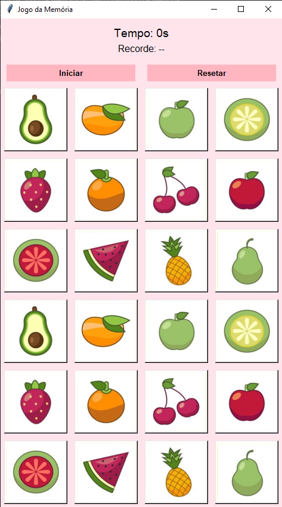

# Jogo da Memória com Python

## Autora: Rayka Alves



## Objetivo

Praticar lógica de programação, estruturas de repetição, listas e manipulação de dados.

## Arquitetura do Projeto:

### 1. Importar bibliotecas

* tkinter: interface gráfica;
* PIL: manipular imagens;
* os: acessar arquivos do sistema;
* random: embaralhar elementos;
* messagebox: mostrar alertas.

```python
import tkinter

import os

import random

from tkinter import messagebox

from PIL import Image, ImageTk
```

---

### 2. Configurações de Personalização

* Definir o tamanho das cartas (em pixels);
* Definir a quantidade de colunas (cartas) no tabuleiro;
* Definir o espaçamento entre as cartas (em pixels);
* Definir as cores (fundo, botão, hover e fundo das cartas).

```python
tamanho = 100
colunas = 4
espaco = 6  # espaço entre cartas

cor_fundo = "#FFE4EC"
cor_botao = "#FFB6C1"
cor_hover = "#FFA6B5"
cor_carta = "#FFFFFF"
```

---

### 3. Definir o caminho das imagens

* Criar uma variável que representa o diretório onde o código Python está localizado (base_dir);
* Criar uma variável que combina o diretório do código com a pasta de imagens (pasta);
* Criar uma variável (arquivos) que liste todos os arquivos da pasta e filtre apenas aqueles com extensão ".png", organizando-os em ordem;
* Criar uma lista que armazena o caminho completo para cada imagem (imagens_caminho).

```python
base_dir = os.path.dirname(os.path.abspath(__file__))
pasta = os.path.join(base_dir, "img")

arquivos = sorted([f for f in os.listdir(pasta) if f.lower().endswith(".png")])
imagens_caminho = [os.path.join(pasta, f) for f in arquivos]
```

---

### 4. Criação da Janela (View)

Padrão: objeto.metodo(parametro=valor)

Exemplo: janela.title("Jogo da Memória")

* Criar uma janela com o tkinter;
* Definir um título para a janela;
* Configurar a cor de fundo da interface.

```python
janela = tkinter.Tk()
janela.title("Jogo da Memória")
janela.configure(bg=cor_fundo)
```

---

### 5. Carregar as imagens

* Criar um dicionário (imagens) para armazenar as imagens carregadas;
* Criar um loop (for) que percorre cada item da lista "imagens_caminho";
* Criar uma variável (img) dentro do loop (for), responsável por abrir cada imagem e redimensioná-la utilizando o método "resize";
* Interligar o dicionário à variável "caminho" (imagens[caminho]), guardando a imagem já convertida para uso no Tkinter;
  OBS: O Tkinter não entende que é uma imagem, então é necessário a conversão.
* Criar uma variável que crie uma nova imagem, a que será o verso da carta, ultilizando o mesmo tamanho e uma cor RGB.

```python
imagens = {}

for caminho in imagens_caminho:
    img = Image.open(caminho).resize((tamanho, tamanho))
    imagens[caminho] = ImageTk.PhotoImage(img)

verso_img = ImageTk.PhotoImage(Image.new("RGB", (tamanho, tamanho), "#F0F0F0"))
```

---

### 6. Estado do Jogo

* Criar uma lista vazia para os botões na tela (botoes = []);

* Criar uma lista vazia para guardar as cartas do jogo, ou seja, as imagens embaralhadas (cartas = []);

* Criar variáveis para armazenar quando a primeira e a segunda carta estiverem selecionadas (primeiro = None e segundo = None);

* Criar uma variável que controla quando o usuário pode clicar nas cartas (bloqueado = False);

* Criar uma variável que controla se o jogo foi iniciado (jogo_iniciado = False);

* Criar uma variável que conta, em segundos, o tempo do jogo (tempo = 0).

* Criar uma variável que conta, em segundos, o melhor recorde do usuário (recorde = None).

* Criar uma variável que armazena a quantidade de pares encontrados durante a partida (pares_encontrados = 0);

```python
botoes = []
cartas = []
primeiro = None
segundo = None
bloqueado = False
jogo_iniciado = False
tempo = 0
recorde = None
pares_encontrados = 0
```

---

### 7. Labels

* Criar elementos de texto que exibem as seguintes informações:
  Quanto tempo se passou desde o início da partida (label_tempo).
  O menor tempo já alcançado pelo usuário, exibido como recorde (label_recorde);
* Configurar a aparência dos labels (texto, fonte e cor de fundo);
* Posicionar os labels na interface utilizando o método grid;

```python
label_tempo = tkinter.Label(janela, text="Tempo: 0s", font=("Arial", 14), bg=cor_fundo)
label_tempo.grid(row=0, column=0, columnspan=colunas, pady=(10, 0))

label_recorde = tkinter.Label(janela, text="Recorde: --", font=("Arial", 12), bg=cor_fundo)
label_recorde.grid(row=1, column=0, columnspan=colunas, pady=(0, 10))
```

---

### 8. Temporizador

* Criar uma função para exercer a função de temporizador (def atualizar_tempo():);
* Acessar a variável global "tempo" para poder alterá-la;
* Determinar que se o jogo começou (jogo_iniciado = True), a variável "tempo" ganha +1 segundo (tempo +=1);
* Atualizar o texto na "label_tempo";
* Criar um loop de tempo de 1000 milissegundos, usando o método "after" para chamar a função novamente.

```python
def atualizar_tempo():
    global tempo

    if jogo_iniciado:
        tempo += 1
        label_tempo.config(text=f"Tempo: {tempo}s")
        janela.after(1100, atualizar_tempo)
```

---

### 9. Iniciar e reiniciar o jogo

* Criar uma função responsável pela interação do usuário com as cartas (def clicar(i));
* Acessar as variáves globais: primeiro, segundo e bloqueado.
* Duplicar as imagens para formar os pares do jogo;
* Embaralhar as cartas para garantir posições aleatórias;
* Criar uma função que reinicia o estado do jogo;
* Voltar as cartas para a imagem inicial (não embaralha novamente automaticamente);
* Zerar variáveis de controle como tempo, pares encontrados e seleção de cartas;

```python
def iniciar_jogo():
    global jogo_iniciado, tempo, cartas, pares_encontrados

    cartas = imagens_caminho * 2
    random.shuffle(cartas)

    pares_encontrados = 0
    tempo = 0
    jogo_iniciado = True

    for i in range(len(botoes)):
        botoes[i].config(image=verso_img)
        botoes[i].image = verso_img

    atualizar_tempo()

def resetar_jogo():
    global jogo_iniciado, tempo, primeiro, segundo, bloqueado, pares_encontrados

    jogo_iniciado = False
    tempo = 0
    primeiro = None
    segundo = None
    bloqueado = False
    pares_encontrados = 0

    label_tempo.config(text="Tempo: 0s")

    for i in range(len(botoes)):
        img = imagens[imagens_caminho[i % len(imagens_caminho)]]
        botoes[i].config(image=img)
        botoes[i].image = img

def clicar(i):
    global primeiro, segundo, bloqueado

    if not jogo_iniciado or bloqueado:
        return

    if botoes[i].image != verso_img:
        return

    botoes[i].config(image=imagens[cartas[i]])
    botoes[i].image = imagens[cartas[i]]

    if primeiro is None:
        primeiro = i
    elif segundo is None:
        segundo = i
        verificar()


```

---

### 10. Verificar Pares

* Criar uma função que compara o par de cartas selecionadas pelo jogador (def verificar());
* Acessar as variáveis globais: bloqueado e pares_encontrados;

```python
def verificar():
    global bloqueado, pares_encontrados

    bloqueado = True

    if cartas[primeiro] == cartas[segundo]:
        pares_encontrados += 1
        resetar_turno()

        if pares_encontrados == len(imagens_caminho):
            fim_de_jogo()
    else:
        janela.after(700, esconder)
```

---

### 11. Funções Complementares

- Criar botões de controle que são responsáveis por iniciar e reiniciar o jogo. Eles chamam funções específicas como iniciar_jogo() e resetar_jogo(), e também possuem efeitos visuais de hover para melhor experiência do usuário. 
- Criar os botões do tabuleiro com laço de repetição, de acordo com a quantidade de imagens disponíveis. Cada botão representa uma carta do jogo e é responsável por exibir o verso ou a imagem da carta quando o jogador clica. Esses botões armazenam sua própria imagem atual e chamam a função clicar(i), que controla toda a lógica de seleção e verificação de pares.

```python

def esconder():
    botoes[primeiro].config(image=verso_img)
    botoes[primeiro].image = verso_img

    botoes[segundo].config(image=verso_img)
    botoes[segundo].image = verso_img

    resetar_turno()


def resetar_turno():
    global primeiro, segundo, bloqueado
    primeiro = None
    segundo = None
    bloqueado = False


def fim_de_jogo():
    global jogo_iniciado, recorde

    jogo_iniciado = False

    if recorde is None or tempo < recorde:
        recorde = tempo
        label_recorde.config(text=f"Recorde: {recorde}s")

    messagebox.showinfo("Parabéns!", f"Você venceu em {tempo} segundos!")
```

---

### 12.0 Botões

```python
def hover_on(e):
    e.widget["bg"] = cor_hover

def hover_off(e):
    e.widget["bg"] = cor_botao

btn_start = tkinter.Button(
    janela,
    text="Iniciar",
    command=iniciar_jogo,
    bg=cor_botao,
    activebackground=cor_hover,
    relief="flat",
    font=("Arial", 10, "bold")
)

btn_start.grid(row=2, column=0, columnspan=colunas//2, sticky="ew", padx=10, pady=5)
btn_start.bind("<Enter>", hover_on)
btn_start.bind("<Leave>", hover_off)

btn_reset = tkinter.Button(
    janela,
    text="Resetar",
    command=resetar_jogo,
    bg=cor_botao,
    activebackground=cor_hover,
    relief="flat",
    font=("Arial", 10, "bold")
)

btn_reset.grid(row=2, column=colunas//2, columnspan=colunas//2, sticky="ew", padx=10, pady=5)
btn_reset.bind("<Enter>", hover_on)
btn_reset.bind("<Leave>", hover_off)

for i in range(len(imagens_caminho) * 2):
    img = imagens[imagens_caminho[i % len(imagens_caminho)]]

    btn = tkinter.Button(
        janela,
        image=img,
        width=tamanho,
        height=tamanho,
        command=lambda i=i: clicar(i),
        bd=2,
        relief="raised",
        bg=cor_carta
    )

    btn.image = img
    btn.grid(
        row=(i // colunas) + 3,
        column=i % colunas,
        padx=espaco,
        pady=espaco
    )

    botoes.append(btn)
```

---

### 13. Iniciar o “modo de funcionamento” da interface:

- Inserir no final do código. Sem ele: a janela mal aparece, o programa fecha instantaneamente e nada responde (cliques, botões, etc.)

```python
janela.mainloop()
```

